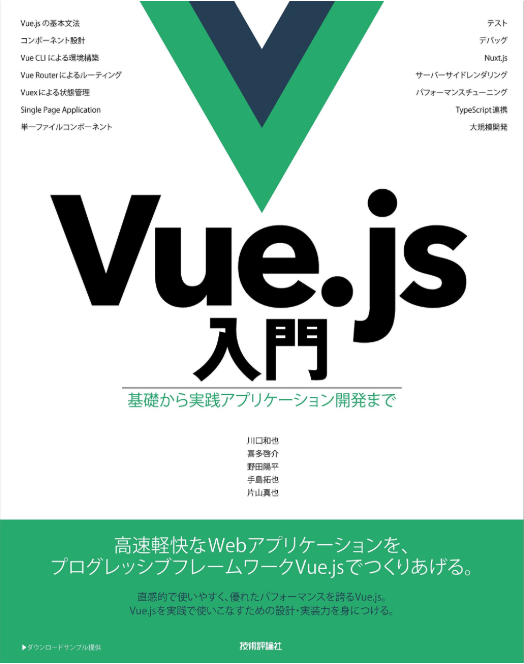

# Vue_Vuex_BOOK



[amazonリンク](https://www.amazon.co.jp/Vue-js入門-基礎から実践アプリケーション開発まで-川口-和也/dp/4297100916/)


### 参考サイト
https://www.udemy.com/learn-vuejs/  
https://qiita.com/denzow  
https://github.com/denzow/DjangoDeKanban  
https://jp.vuejs.org/v2/guide/installation.html  
https://vuex.vuejs.org/ja/installation.html  
https://qiita.com/FumioNonaka/items/af16147d5232b803339b  


### Vue.js & Vuex のインストール方法  
https://vuex.vuejs.org/ja/installation.html  
https://jp.vuejs.org/v2/guide/installation.html  

  
#### CDN  
```
<script src="/path/to/vue.js"></script>
<script src="/path/to/vuex.js"></script>
```

#### npm  
$ npm install vuex --save  

#### yarm
$ yarn add vuex


3種類のみ  
よく使われるのはnpmだけど、導入が難しい環境なら  
CDNでもいいかも(リンク先が変わる心配だけ注意）  

https://qiita.com/fuqda/items/90073e3cd0987c82553d  
**npmやyarmを利用する場合**  
Vue.useを使えるのはVue.js用に作られたライブラリを使う場合  
* npmなどでインストールするVue.jsのライブラリとは異なる外部ライブラリは、  
Vue.use で記載しない  
(ここの場合は axios をimportしているが、Vue.js用に作られたライブラリではないので、 Vue.use を使わない)  


### vue-cli
これを使うことで  
import Vuex from 'vuex' や  
import Vue from 'vue' などメインのものをインストール可能  
https://qiita.com/sin_tanaka/items/29769266b3b078ea0f7c  

vue-cliは雛形からプロジェクトを作成してくれる公式ツールです。  
公式には、「nodeやnpm、webpackに詳しくないならあまり使わないほうがいいよ」と  
書いてあるのですがとても便利なので使います。  
```
% npm install -g vue-cli

% vue --version
2.8.2
```

## 概念
簡単な理解としては、  
npmがバージョン管理ツール  
vue-cli(django)でdjangoコマンド(ここではwebpack) が使える様になった様なもの  
そのおかげで環境を構築できる  
```
$ vue init webpack sample
```

